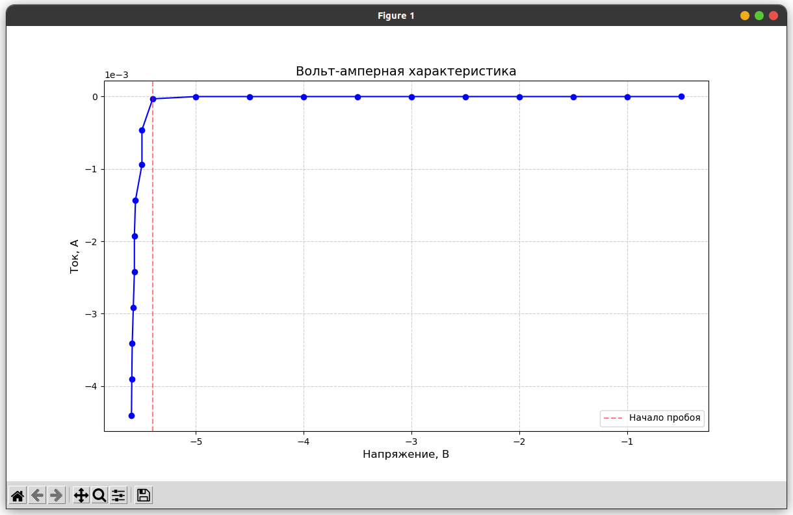

# Лабораторная работа №1

### Теория
Стабилитрон — это полупроводниковый диод, предназначенный для работы в режиме обратного пробоя. Его ключевая особенность — способность поддерживать почти постоянное напряжение на своих выводах ($U_{\text ст}$) при значительном изменении обратного тока ($I_{\text ст}$). Это свойство используется в параметрических стабилизаторах напряжения для защиты нагрузки от колебаний входного напряжения.

Стабилитроны работают на основе двух типов пробоя:
1. Туннельный (Зенеровский) пробой:
    - Возникает в сильнолегированных $p^+$- $n^+$ переходах ($U_{\text ст} < 5 B$ )
    - Обусловлен туннелированием электронов сквозь узкий потенциальный барьер.
    - Напряжение пробоя зависит от концентрации примесей.
2. Лавинный пробой:
    - Характерен для слаболегированных переходов ($U_{\text ст} > 8 B$ ).
    - Электроны, ускоряемые полем, ионизируют атомы, вызывая лавинное умножение носителей.
    - Напряжение пробоя:

$$U_{\text пр} = E_{\text кр} \cdot W$$ 

Схема стабилизатора включает:
- Стабилитрон (_D_)— задает опорное напряжение.
- Балластный резистор ($R_{\text б}$) — ограничивает ток через стабилитрон и гасит избыточное напряжение.
- Нагрузка ($R_{\text н}$) — подключается параллельно стабилитрону.

Сопротивление $R_{\text б}$ рассчитывается по формуле:

$$R_{\text б} = \frac{U_{\text вх} - U_{\text ст}}{I_{\text ст} + I_{\text н}}$$

Коэффициент стабилизации $K_{\text ст}$:

$$K_{\text ст} = \frac{\Delta U_{\text вх}/\Delta U_{\text вх}}{\Delta U_{\text вых}/\Delta U_{\text вых}}$$

КПД ${\eta}$:

$${\eta} = \frac{P_{\text вых}}{P_{\text вх}} \times 100 \% $$

Выходное сопротивление $R_{\text вых}$:

$$R_{\text вых} = \frac{\Delta U_{\text вых}}{\Delta I_н} \approx R_{\text дифф}$$ 

### Измерение ВАХ стабилитрона

При измерении ВАХ нагрузка ($R_{\text н}$) должна быть отключена.

#### Для обратного подключения стабилитрона:
Берем источник с диапазоном от $0$ до $10B$.

$R_{\text б } = 1кОм$

| $U_{\text ст}$ | $I_{\text ст}$ |
| :------------: | :------------: |
|       0        |       0        |
|      0.5       |  -171.424 nA   |
|       1        |  -171.435 nA   |
|      1.5       |  -171.435 nA   |
|       2        |  -171.435 nA   |
|      2.5       |  -171.435 nA   |
|       3        |  -171.435 nA   |
|      3.5       |  -171.435 nA   |
|       4        |  -171.435 nA   |
|      4.5       |  -171.435 nA   |
|       5        |  -171.436 nA   |
|      5.5       |   -31.338 μA   |
|       6        |   -461.63 μA   |
|      6.5       |  -943.146 μA   |
|       7        |   -1.432 mA    |
|      7.5       |   -1.925 mA    |
|       8        |   -2.419 mA    |
|      8.5       |   -2.914 mA    |
|       9        |    -3.41 mA    |
|      9.5       |   -3.906 mA    |
|       10       |   -4.403 mA    |

На рисунке видно, что пробой произошел при напряжении в $5.6В$

График зависимости тока от напряжения

**Характер ВАХ**:
- При напряжении V < 5.5 В ток крайне мал (порядка -171 нА), что соответствует закрытому состоянию стабилитрона в обратном включении.
- При V ≥ 5.5 В ток резко возрастает (до -4.4 мА), что соответствует зоне пробоя стабилитрона.
- Резкий рост тока начинается при V ≈ 5.5 В, что близко к типичному напряжению стабилизации для стабилитронов (например, 5.6 В для КС156).

#### Для прямого подключения стабилитрона:
Берем источник с диапазоном от $0$ до $20B$.

$R_{\text б } = 1кОм$

| $U_{\text ст}$ | $I_{\text ст}$ |
| :------------: | :------------: |
|       0        |       0        |
|       1        |   597.63 μA    |
|       2        |    1.529 mA    |
|       3        |    2.504 mA    |
|       4        |    3.487 mA    |
|       5        |    4.474 mA    |
|       6        |    5.464 mA    |
|       7        |    6.455 mA    |
|       8        |    7.448 mA    |
|       9        |    8.441 mA    |
|       10       |    9.435 mA    |
|       11       |    10.43 mA    |
|       12       |   11.425 mA    |
|       13       |   12.421 mA    |
|       14       |   13.417 mA    |
|       15       |   14.413 mA    |
|       16       |    15.41 mA    |
|       17       |   16.407 mA    |
|       18       |   17.404 mA    |
|       19       |   18.401 mA    |
|       20       |   19.398 mA    |
<!-- $$ R_{\text{дифф}} = \frac{\Delta U}{\Delta I} = \frac{U_2 - U_1}{I_2 - I_1} = 46 \Omega $$ -->

