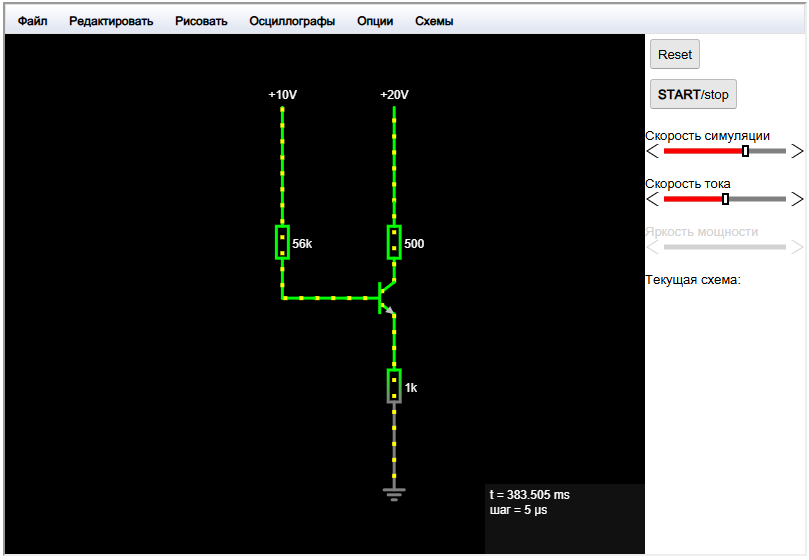
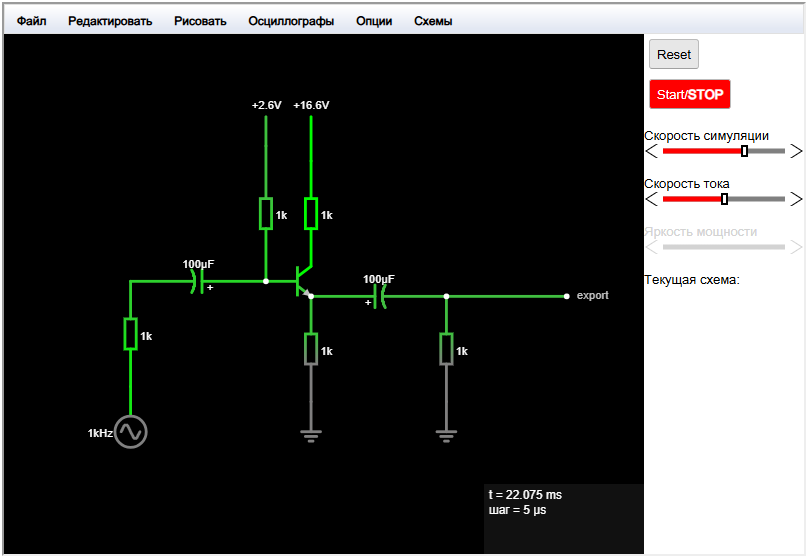
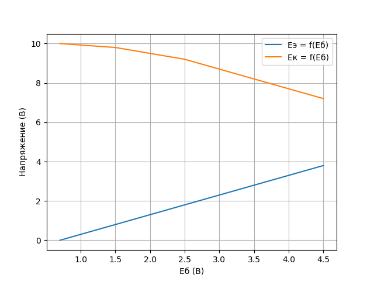

# Лабораторная работа #2
Исследование каскада с общим коллектором    

### Измерение управляющей характеристики эмиттерного повторителя
E1 = 12 В (питание базы)
E2 = 10 В (питание коллектора)
Rб = 3 кОм
Rк = 500 Ом
Rэ = 1 кОм
Транзистор: n-p-n

Данные измерений (пример):

| Eб (В) | Eэ (В) | Eк (В) |
| ------ | ------ | ------ |
| 0.7    | 0.0    | 10.0   |
| 1.5    | 0.8    | 9.8    |
| 2.5    | 1.8    | 9.2    |
| 3.5    | 2.8    | 8.2    |
| 4.5    | 3.8    | 7.2    |

График:

Коэффициент усиления по мощности (Kp):
Для рабочей точки Eб = 2.5 В:

Pвх = (12 - 2.5)² / 3000 ≈ 0.027 Вт

Pвых = (1.8)² / 1000 ≈ 0.00324 Вт

Kp = 0.00324 / 0.027 ≈ 0.12

###  Измерение динамического диапазона и входного сопротивления

| Параметр | Rн = 1 кОм | Rн = 0.5 кОм |
| -------- | ---------- | ------------ |
| 2Amax    | 8.0        | 6.0          |
| Rвх, кОм | 50         | 30           |
**Расчет входного сопротивления:**

- Для Rн = 1 кОм:  
    U_б~ = 5 В , ΔU~ = 0.1 В (на Rг = 10 кОм).  
    I_б~ = 0.1 / 10000 = 0.01 мА.  
	    Rвх~ = 5 / 0.01 = 500 кОм (c шунтированием Rб).

### Параметрический стабилизатор с усилителем

|Параметр|Без усилителя|С усилителем|
|---|---|---|
|Кст|15|50|
|η (%)|40|60|
|Кн|0.05|0.02|

- Усилитель повышает Кст и η, снижает влияние нагрузки (Кн).
- Несовпадение с теорией связано с потерями в транзисторе и неточностями моделирования

$${\eta} = \frac{P_{\text вых}}{P_{\text вх}} \times 100 \% \approx 60 \% $$

Влияние конденсаторов: при f = 10 кГц, C1 и C2 должны быть ≥ 1 мкФ (для минимизации реактивного сопротивления)

Вывод: Каскад с общим коллектором эффективно согласует импедансы и стабилизирует напряжение, что подтверждается экспериментами.

