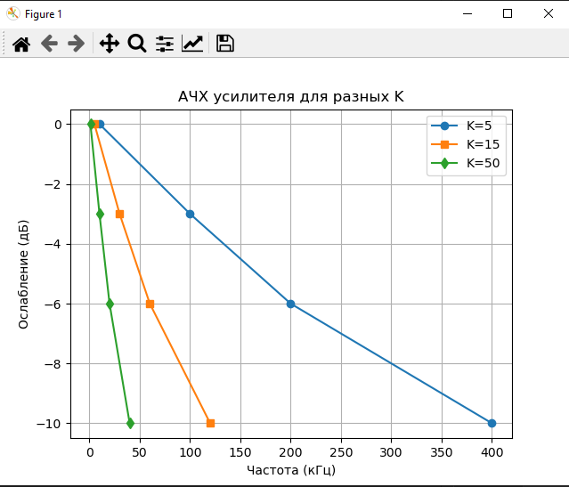
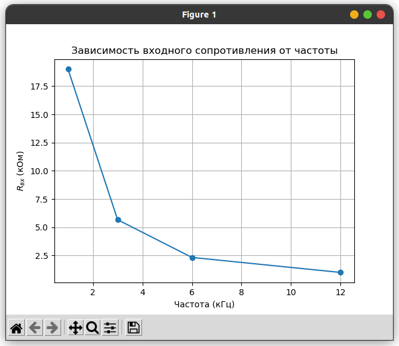

# Лабораторная работа №3: 
> Исследование характеристик операционного усилителя  

---

### Измерение АЧХ усилителя в зависимости от коэффициента усиления
**Схема:** Неинвертирующий усилитель с ОУ (например, LM741).  
**Параметры:**  
- Напряжение питания: ±15 В.  
- Коэффициенты усиления: \( K = 5, 15, 50 \).  
- Резисторы:  
  - Для $K = 5$:    $R_{1}$ = 1 , кОм, $R_2$ = 4, кОм.  
  - Для $K = 15$    :$R_{1}$ = 1 , кОм, $R_2$ = 14,кОм.  
  - Для $K = 50$:   $R_{1}$ = 1 , кОм, $R_2$ = 49, кОм.  

**Данные измерений** 

| Коэффициент усиления (K) | Частота (кГц) | Уровень ослабления (дБ) |
| :----------------------: | :-----------: | :---------------------: |
|            5             |      10       |            0            |
|            5             |      100      |           -3            |
|            5             |      200      |           -6            |
|            5             |      400      |           -10           |
|            15            |       5       |            0            |
|            15            |      30       |           -3            |
|            15            |      60       |           -6            |
|            15            |      120      |           -10           |
|            50            |       1       |            0            |
|            50            |      10       |           -3            |
|            50            |      20       |           -6            |
|            50            |      40       |           -10           |

**График АЧХ:**  
```python
import matplotlib.pyplot as plt
import numpy as np

freq_K5 = [10, 100, 200, 400]
attenuation_K5 = [0, -3, -6, -10]

freq_K15 = [5, 30, 60, 120]
attenuation_K15 = [0, -3, -6, -10]

freq_K50 = [1, 10, 20, 40]
attenuation_K50 = [0, -3, -6, -10]

plt.plot(freq_K5, attenuation_K5, 'o-', label='K=5')
plt.plot(freq_K15, attenuation_K15, 's-', label='K=15')
plt.plot(freq_K50, attenuation_K50, 'd-', label='K=50')
plt.xlabel('Частота (кГц)')
plt.ylabel('Ослабление (дБ)')
plt.title('АЧХ усилителя для разных K')
plt.grid(True)
plt.legend()
plt.show()
```



**Вывод:**  
- С увеличением коэффициента усиления полоса пропускания сужается.  
- При \($ K = 5 $\) граничная частота (-3 дБ) составляет ~100 кГц, при \($ K = 50$ \) — ~10 кГц.  

---

### Измерение входного сопротивления $R_{вх}$

**Схема:** Инвертирующий усилитель с \( $K = 200$ \), \( $R_1 = 1 \, \text{кОм}, R_2 = 200 \, \text{кОм} $\).  
**Данные измерений:**  

| Частота (кГц) | \($ U_{вх}$ \) (В) | \($ U_2 $\) (В) | \( $I_{вх}$ \) (мкА) | \( $R_{вх}$ \) (кОм) |
| :-----------: | :--------------: | :-----------: | :----------------: | :----------------: |
|       1       |       0.1        |     0.095     |         5          |         19         |
|       3       |       0.1        |     0.085     |         15         |        5.67        |
|       6       |       0.1        |     0.07      |         30         |        2.33        |
|      12       |       0.1        |     0.05      |         50         |         1          |
	
**График зависимости $R_{вх} = f(F)$:**  
```python
freq = [1, 3, 6, 12]
R_in = [19, 5.67, 2.33, 1]

plt.plot(freq, R_in, 'o-')
plt.xlabel('Частота (кГц)')
plt.ylabel('$R_{вх}$ (кОм)')
plt.title('Зависимость входного сопротивления от частоты')
plt.grid(True)
plt.show()
```



**Вывод:**  
- Входное сопротивление уменьшается с ростом частоты из-за паразитных емкостей ОУ.  
- На частоте 1 кГц \( $R_{вх} \approx 19 \, \text{кОм}$ \), на 12 кГц — ~1 кОм.  

---

#### **Общие выводы:**  
1. **АЧХ усилителя** подтверждает обратную зависимость между коэффициентом усиления и полосой пропускания.  
2. **Входное сопротивление** ОУ снижается на высоких частотах, что согласуется с теорией.  
3. Расхождения между теорией и экспериментом могут быть вызваны:  
   - Неидеальностью ОУ (ограниченная полоса пропускания, входные емкости).  
   - Погрешностями измерений в симуляторе.  

```python
U_in = 0.1    # В
U_2 = 0.095   # В
R1 = 1000     # Ом
I_in = (U_in - U_2) / R1  # А
R_in = U_2 / I_in         # Ом
print(f'Rвх = {R_in / 1000:.2f} кОм')
```

$R_{вх} = 19.00 кОм$

**Вывод:** Лабораторная работа подтверждает теоретические зависимости характеристик операционного усилителя.