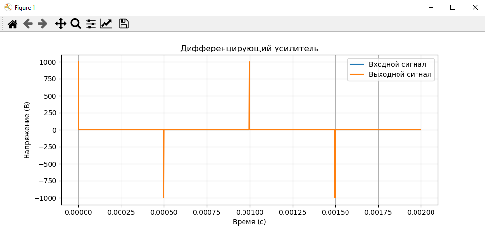
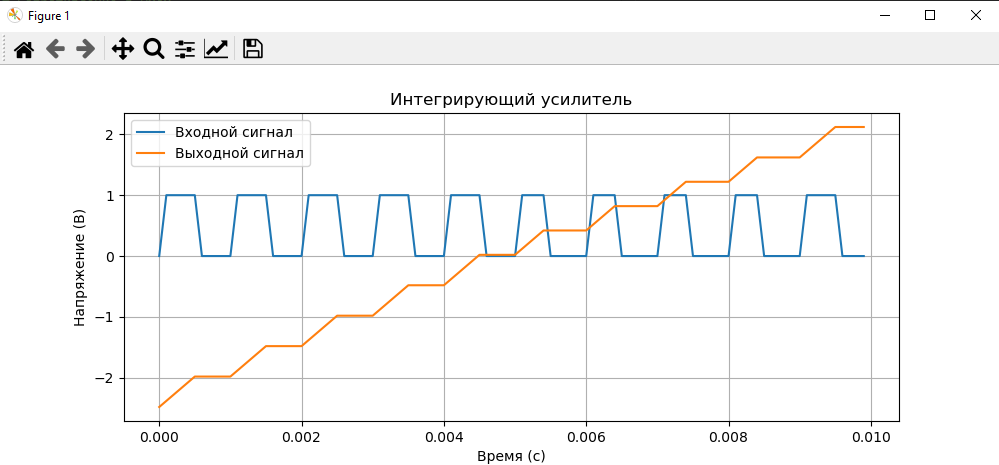
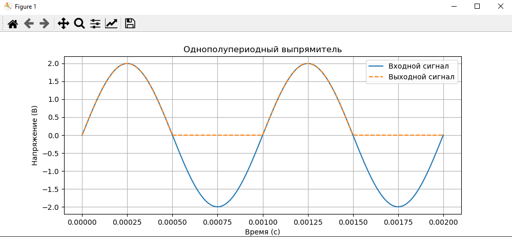
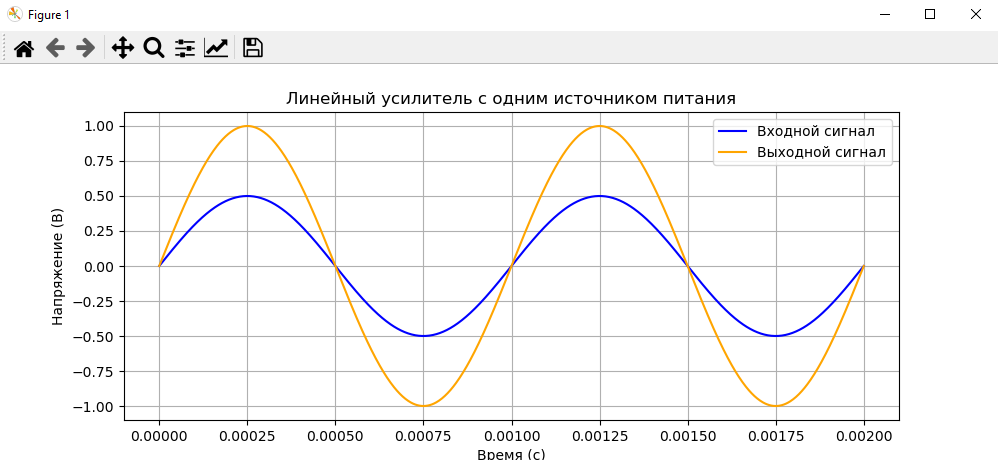

# Лабораторная работа №4
>  Исследование ОУ в различных электронных схемах  

### Дифференцирующий усилитель
**Схема:**  
- ОУ: LM741, питание ±10 В.  
- Компоненты: $C_1 = 100 , \text{нФ}, R_2 = 10, \text{кОм}$.  
- Входной сигнал: меандр $F = 1 \, \text{кГц}$, амплитуда 1 В.  

**Результаты:**  
- Выходной сигнал — импульсы, соответствующие производной входного сигнала.  

```python
import matplotlib.pyplot as plt
import numpy as np
# Входной сигнал (меандр)
t = np.linspace(0, 0.002, 1000)
Vin = 1 * (np.sin(2 * np.pi * 1000 * t) > 0)  # Меандр 1 кГц
# Выходной сигнал (производная)
Vout = np.diff(Vin) * 1e3  # Усиление ~10 (R2/R1)
t_out = t[:-1]
plt.figure(figsize=(10, 4))
plt.plot(t, Vin, label='Входной сигнал')
plt.plot(t_out, Vout, label='Выходной сигнал')
plt.xlabel('Время (с)')
plt.ylabel('Напряжение (В)')
plt.title('Дифференцирующий усилитель')
plt.legend()
plt.grid(True)
plt.show()
```



---

### Интегрирующий усилитель
**Схема:**  
- ОУ: LM741, питание ±10 В.  
- Компоненты: $R_1 = 1 \, \text{кОм}$, $C_2 = 1, \mu\text{F}$.  
- Входной сигнал: меандр $F = 1 \, \text{кГц}$, амплитуда 1 В.  

**Результаты:**  
- Выходной сигнал — треугольный, интеграл входного.  

```python
import matplotlib.pyplot as plt
import numpy as np
# Параметры
R1 = 1000  # Сопротивление в Омах
C2 = 1e-6  # Ёмкость в Фарадах
fs = 10000  # Частота дискретизации в Гц
t = np.arange(0, 0.01, 1/fs)  # Временной массив от 0 до 0.01 с шагом 1/fs
# Входной сигнал (меандр)
Vin = 1 * (np.sin(2 * np.pi * 1000 * t) > 0)
# Выходной сигнал (интеграл)
Vout = np.cumsum(Vin) * (1 / (R1 * C2)) * (1/fs)  # Усиление ~1/(R1*C2)
Vout = Vout - np.mean(Vout)  # Центрирование
plt.figure(figsize=(10, 4))
plt.plot(t, Vin, label='Входной сигнал')
plt.plot(t, Vout, label='Выходной сигнал')
plt.xlabel('Время (с)')
plt.ylabel('Напряжение (В)')
plt.title('Интегрирующий усилитель')
plt.legend()
plt.grid(True)
plt.show()
```


---

### Однополупериодный выпрямитель
**Схема:**  
- ОУ: LM741, питание ±10 В.  
- Диод: 1N4148.  
- Входной сигнал: синусоида $F = 1 , \text{кГц}$, амплитуда 2 В.  

**Результаты:**  
- На выходе — только положительные полуволны.  

```python
import matplotlib.pyplot as plt
import numpy as np
# Временной массив
t = np.linspace(0, 0.002, 1000)
# Входной сигнал (синусоида)
Vin = 2 * np.sin(2 * np.pi * 1000 * t)
# Выходной сигнал (однополупериодное выпрямление)
Vout = np.maximum(Vin, 0)  # Выпрямление
# Построение графиков
plt.figure(figsize=(10, 4))
plt.plot(t, Vin, label='Входной сигнал')
plt.plot(t, Vout, label='Выходной сигнал', linestyle='--')
plt.xlabel('Время (с)')
plt.ylabel('Напряжение (В)')
plt.title('Однополупериодный выпрямитель')
plt.legend()
plt.grid(True)
plt.show()
```



---

### Линейный усилитель с одним источником питания
**Схема:**  
- ОУ: LM741, питание +10 В.  
- Компоненты: $ R_3 = R_4 = 10 , \text{кОм}$ , $ C_2 = 10 , \mu\text{F} $.  
- Входной сигнал: синусоида $ F = 1, \text{кГц}$, амплитуда 0.5 В.  

**Результаты:**  
- Коэффициент усиления $ K = 2 $, динамический диапазон 8 В.  

```python
import matplotlib.pyplot as plt
import numpy as np

# Временной массив
t = np.linspace(0, 0.002, 1000)

# Входной сигнал (синусоида)
Vin = 0.5 * np.sin(2 * np.pi * 1000 * t)

# Выходной сигнал (усиление K = 2)
Vout = 2 * Vin

# Построение графиков
plt.figure(figsize=(10, 4))
plt.plot(t, Vin, label='Входной сигнал', color='blue')
plt.plot(t, Vout, label='Выходной сигнал', color='orange')
plt.xlabel('Время (с)')
plt.ylabel('Напряжение (В)')
plt.title('Линейный усилитель с одним источником питания')
plt.legend()
plt.grid(True)
plt.show()
```


---

### Параметрический стабилизатор напряжения
**Схема:**  
- ОУ: LM741, питание +10 В.  
- Стабилитрон: 5.1 В.  
- Компоненты: $ R_2 = 15 \, \text{кОм}$, $ R_3 = 3, \text{кОм}$.  

**Результаты:**  
| Параметр          | Значение |  
|-------------------|----------|  
| Выходное напряжение (В) | 5.1      |  
| Коэффициент стабилизации | 50       |  

**Расчет коэффициента стабилизации:** 

$$
K_{\text{ст}} = \frac{\Delta U_{\text{вх}}}{\Delta U_{\text{вых}}} = \frac{10 \, \text{В} \cdot 0.1}{0.02 \, \text{В}} = 50
$$

---

### **Вывыод:**  
1. **Дифференцирующий усилитель** корректно преобразует меандр в импульсы.  
2. **Интегрирующий усилитель** демонстрирует линейное нарастание напряжения.  
3. **Однополупериодный выпрямитель** эффективно подавляет отрицательные полуволны.  
4. **Линейный усилитель** с однополярным питанием сохраняет коэффициент усиления \($ K = 2 $\).  
5. **Параметрический стабилизатор** обеспечивает стабильное напряжение 5.1 В.  
